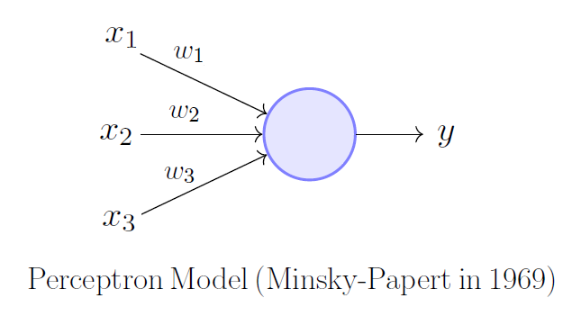
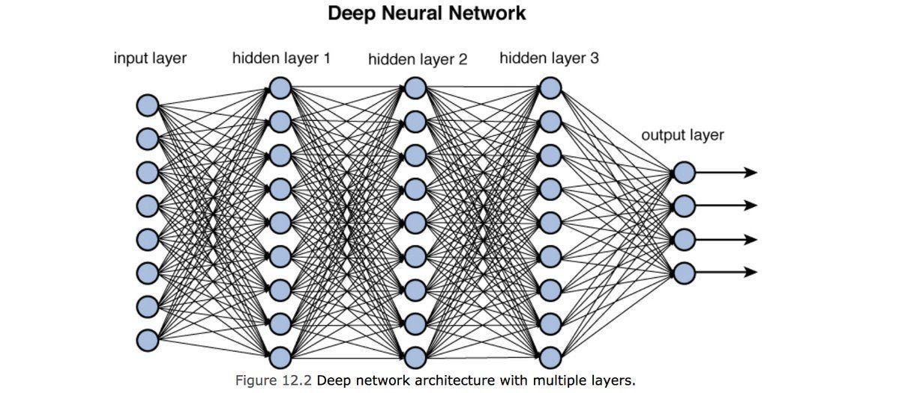
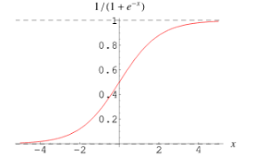

# 10.12 Neural Networks: Feedforward Algorithm Part 1

## Perceptron
An early idea of a feedforward network is the perceptron which uses the Heaviside step function as its activation function:
<div style="text-align:center"></div>

Where a set of inputs $x_1$, $x_2$ and $x_3$ are multiplied by the weights $w_1$, $w_2$ and $w_3$, go through the heaviside step function to produce a $1$ or $0$ as an output. It is also known as the single layer perceptron. This works well for very simple problems such as designing an `XOR` switch where the inputs $x_1$ `= True` and $x_2$ `= False` produces an output of `False`. However, for much more complex problems such as classification or regression, a multilayer perceptron, a neural network, is more useful.
<div style="text-align:center"></div>

## Neural Network
The multilayer perceptron, the neural network, consists of an input layer, $1$ or more hidden layers and an output layer. For an image classification problem, the input shape would be the size of 1 image, e.g.: $(28, 28, 3)$, an RGB image, and its output shape would be the number of classes to classify, e.g.: $10$. 
<div style="text-align:center"></div>

## Activation Function
The sigmoid function shown below is used to introduce non-linearity into the network to allow it to solve non-linear problems. It will take any number and return a number between $0$ and $1$.
\[\bm{f(x) = \frac{1}{1 + e^{-x}}}\]
<div style="text-align:center"></div>

## Network Layers & Feedforward
Every layer has a set of nodes which have their input value, be it the network input or the value from the previous layer, a bias and a set of weights to connected nodes. The connection can be represented as:

\[\bm{\sigma\left(
\begin{bmatrix}
  w_{11} & w_{12} & w_{13} \\
  w_{21} & w_{22} & w_{23}
\end{bmatrix}
\begin{bmatrix}
  x_{11} \\ x_{12} \\ x_{13}
\end{bmatrix}
+
\begin{bmatrix}
  b_{11} \\ b_{12} \\ b_{13}
\end{bmatrix}
\right)}\]

Where the output of this is the input to the next layer for a neural network with 3 nodes in it's first layer and 2 nodes in it's second layer and the activation function is the sigmoid, $\sigma$, function. This set of matrix operations can also be represented as:
\[\bm{\sigma(W_{ij} \cdot I_i + B_i)}\]

This happens at every node at every layer up until the last output layer.

# 10.13: Neural Networks: Feedforward Algorithm Part 2

## Simple Implementation
The feedforward implementation might look something like this:
```py
class Matrix:
    def __init__(rows: int, columns: int):
        # init weights as random values
        self.__shape = (rows, columns)
        self.__data = [[0 for _ in range(columns)] for _ in range(rows)]

    def randomize(self, min: int, max: int):
        for y in range(self.__shape[0]):
            for x in range(self.__shape[1]):
                self.__data[y][x] = random.random(min, max)
```
```py
class NeuralNetwork:
    def __init__(self, input_nodes, hidden_nodes, output_nodes):
        self._input_nodes = input_nodes
        self._hidden_nodes = hidden_nodes
        self._output_nodes = output_nodes

        self._weights_ih = Matrix(self._hidden_nodes, self._input_nodes)
        self._weights_ho = Matrix(self._output_nodes, self._hidden_nodes)
        self._weights_ih.randomize(-1, 1)
        self._weights_ho.randomize(-1, 1)

        self._biases_h = Matrix(self._hidden_nodes, 1)
        self._biases_o = Matrix(self._output_nodes, 1)
        self._biases_h.randomize(-1, 1)
        self._biases_o.randomize(-1, 1)

    def feed_forward(input):
        # do feedforward algorithm for input -> hidden layer
        hidden = Matrix.multiply(self._weights_ih, input)
        hidden.add(self._biases_h)
        hidden.apply(lambda x: 1 / (1 + np.exp(-x)))

        # do feedforward algorithm for hidden -> output layer
        output = Matrix.multiply(self._weights_ho, hidden)
        output.add(this._biases_o)
        output.apply(lambda x: 1 / (1 + np.exp(-x)))

        return output
```

where the matrix operations are all hidden behind the method `NeuralNetwork.feed_forward`.
```py
nn = NeuralNetwork(2, 2, 1)
inputs = [1, 0]
output = nn.feed_forward(inputs)
```